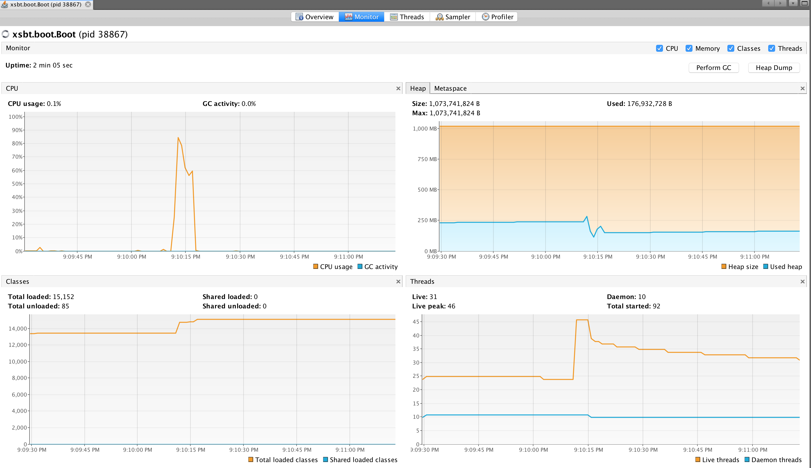
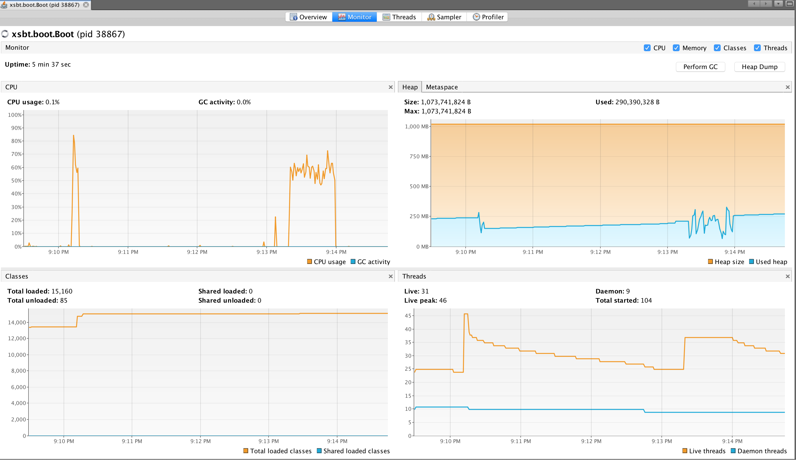

Web API benchmarks
------------------

- server uses akka-http


run
---

```
sbt clean compile
sbt run
```


run benchmarks
--------------

Server config
-------------

```
$ system_profiler SPHardwareDataType | grep "  Memory:"
      Memory: 16 GB

$ system_profiler SPHardwareDataType | grep Cores:
      Total Number of Cores: 4

$ system_profiler SPHardwareDataType | grep Processors:
      Number of Processors: 1
```

1- concurrency of 100 for 10^5 requests
---------------------------------------


```
ab -n 100000 -c 100 -k http://127.0.0.1:9191/chat
This is ApacheBench, Version 2.3 <$Revision: 1807734 $>
Copyright 1996 Adam Twiss, Zeus Technology Ltd, http://www.zeustech.net/
Licensed to The Apache Software Foundation, http://www.apache.org/

Benchmarking 127.0.0.1 (be patient)
Completed 10000 requests
Completed 20000 requests
Completed 30000 requests
Completed 40000 requests
Completed 50000 requests
Completed 60000 requests
Completed 70000 requests
Completed 80000 requests
Completed 90000 requests
Completed 100000 requests
Finished 100000 requests


Server Software:        akka-http/10.0.11
Server Hostname:        127.0.0.1
Server Port:            9191

Document Path:          /chat
Document Length:        35 bytes

Concurrency Level:      100
Time taken for tests:   5.247 seconds
Complete requests:      100000
Failed requests:        0
Keep-Alive requests:    100000
Total transferred:      19400000 bytes
HTML transferred:       3500000 bytes
Requests per second:    19058.55 [#/sec] (mean)
Time per request:       5.247 [ms] (mean)
Time per request:       0.052 [ms] (mean, across all concurrent requests)
Transfer rate:          3610.70 [Kbytes/sec] received

Connection Times (ms)
              min  mean[+/-sd] median   max
Connect:        0    0   0.1      0       5
Processing:     0    5  37.2      3    1877
Waiting:        0    5  37.2      3    1877
Total:          0    5  37.3      3    1878

Percentage of the requests served within a certain time (ms)
  50%      3
  66%      3
  75%      4
  80%      5
  90%      6
  95%     10
  98%     16
  99%     31
 100%   1878 (longest request)
```




2 - 1 million requests
----------------------

```
ab -n 1000000 -c 100 -k http://127.0.0.1:9191/chat
This is ApacheBench, Version 2.3 <$Revision: 1807734 $>
Copyright 1996 Adam Twiss, Zeus Technology Ltd, http://www.zeustech.net/
Licensed to The Apache Software Foundation, http://www.apache.org/

Benchmarking 127.0.0.1 (be patient)
Completed 100000 requests
Completed 200000 requests
Completed 300000 requests
Completed 400000 requests
Completed 500000 requests
Completed 600000 requests
Completed 700000 requests
Completed 800000 requests
Completed 900000 requests
Completed 1000000 requests
Finished 1000000 requests


Server Software:        akka-http/10.0.11
Server Hostname:        127.0.0.1
Server Port:            9191

Document Path:          /chat
Document Length:        35 bytes

Concurrency Level:      100
Time taken for tests:   39.193 seconds
Complete requests:      1000000
Failed requests:        0
Keep-Alive requests:    1000000
Total transferred:      194000000 bytes
HTML transferred:       35000000 bytes
Requests per second:    25514.79 [#/sec] (mean)
Time per request:       3.919 [ms] (mean)
Time per request:       0.039 [ms] (mean, across all concurrent requests)
Transfer rate:          4833.86 [Kbytes/sec] received

Connection Times (ms)
              min  mean[+/-sd] median   max
Connect:        0    0   0.0      0       5
Processing:     0    4   8.4      3     405
Waiting:        0    4   8.3      3     405
Total:          0    4   8.4      3     408

Percentage of the requests served within a certain time (ms)
  50%      3
  66%      3
  75%      3
  80%      3
  90%      4
  95%      6
  98%     22
  99%     35
 100%    408 (longest request)
```



3 - 10M requests
----------------


```
ab -n 10000000 -c 100 -k http://127.0.0.1:9191/chat
This is ApacheBench, Version 2.3 <$Revision: 1807734 $>
Copyright 1996 Adam Twiss, Zeus Technology Ltd, http://www.zeustech.net/
Licensed to The Apache Software Foundation, http://www.apache.org/

Benchmarking 127.0.0.1 (be patient)
Completed 1000000 requests
Completed 2000000 requests
Completed 3000000 requests
Completed 4000000 requests
Completed 5000000 requests
Completed 6000000 requests
Completed 7000000 requests
Completed 8000000 requests
Completed 9000000 requests
Completed 10000000 requests
Finished 10000000 requests


Server Software:        akka-http/10.0.11
Server Hostname:        127.0.0.1
Server Port:            9191

Document Path:          /chat
Document Length:        35 bytes

Concurrency Level:      100
Time taken for tests:   468.758 seconds
Complete requests:      10000000
Failed requests:        0
Keep-Alive requests:    10000000
Total transferred:      1940000000 bytes
HTML transferred:       350000000 bytes
Requests per second:    21332.96 [#/sec] (mean)
Time per request:       4.688 [ms] (mean)
Time per request:       0.047 [ms] (mean, across all concurrent requests)
Transfer rate:          4041.60 [Kbytes/sec] received

Connection Times (ms)
              min  mean[+/-sd] median   max
Connect:        0    0   0.0      0      71
Processing:     0    5   8.5      3     263
Waiting:        0    5   8.4      3     263
Total:          0    5   8.5      3     263

Percentage of the requests served within a certain time (ms)
  50%      3
  66%      4
  75%      4
  80%      5
  90%      6
  95%      8
  98%     22
  99%     36
 100%    263 (longest request)
```
